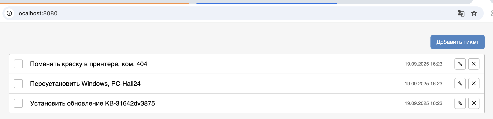
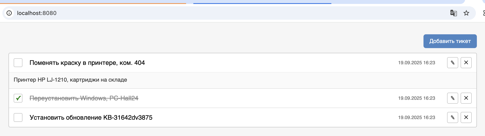
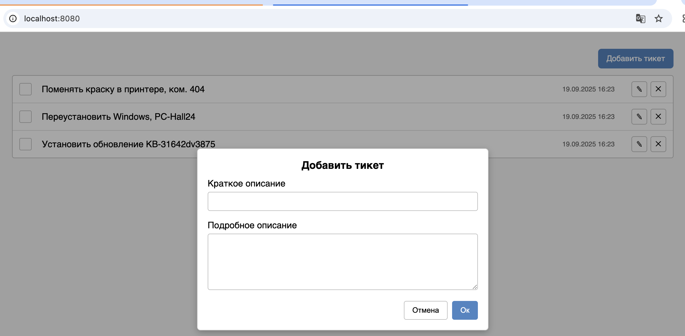
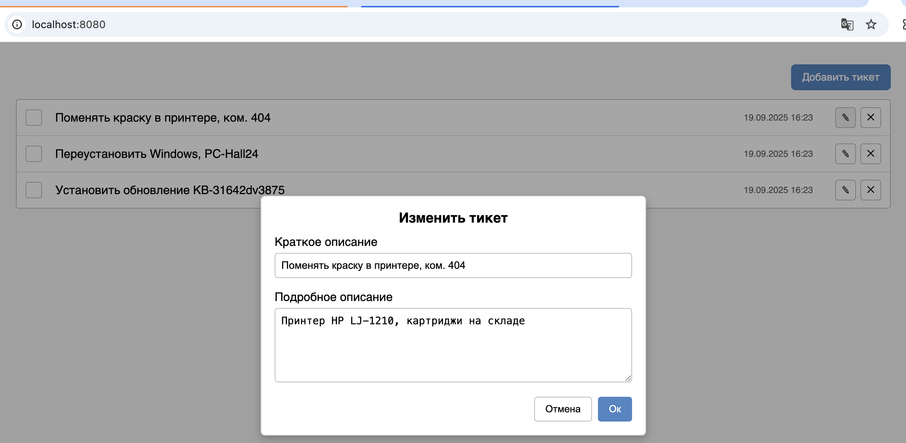
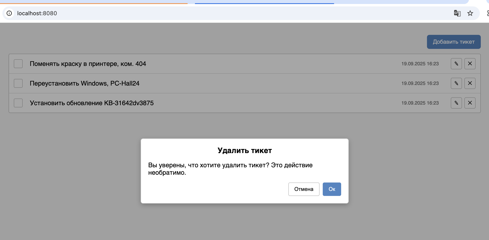

# HelpDesk

Проект представляет собой упрощённую версию **helpdesk** — систему управления задачами.  
Цель — отработать навыки работы взаимодействия с сервером.

---

## 🚀 Функционал

- Отображение всех тикетов с сервера  
- Создание нового тикета  
- Изменение тикета (редактирование)  
- Удаление тикета (с подтверждением)  
- Просмотр полного описания тикета (по клику на заголовок)  
- Отметка выполнения (с зачёркиванием заголовка и зелёной галочкой)  
- Модальные окна для форм и подтверждения действий 

---

## 📸 Скриншоты интерфейса

### Список тикетов

### Просмотр полного описания

### Модальное окно добавления тикета

### Модальное окно редактирования

### Модальное окно подтверждения удаления

---

## ⚙️ Технологии проекта

	•	Frontend: JavaScript (ES6), Webpack, Babel, CSS
	•	Backend: Node.js, Express
	•	CI/CD: GitHub Actions + GitHub Pages

